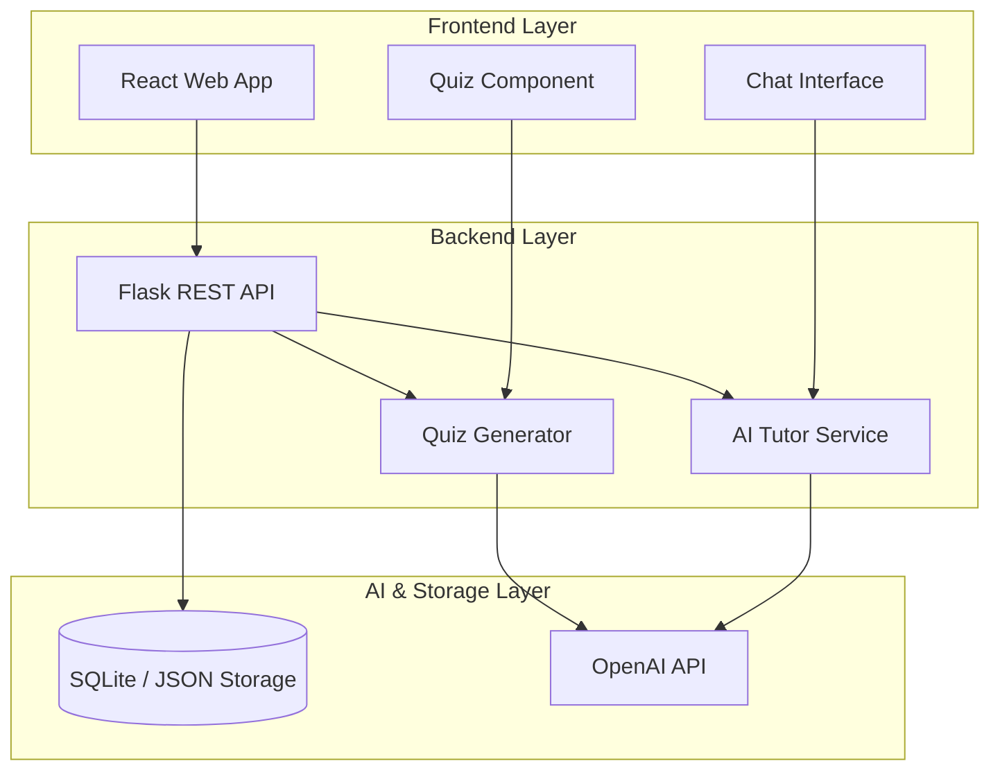
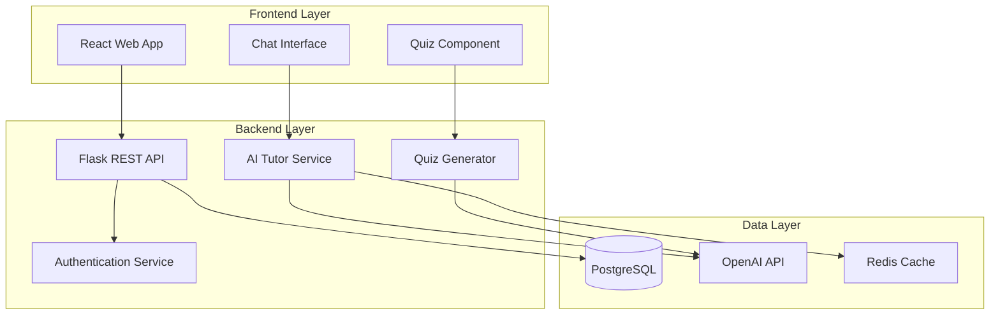

# Design Document: AI Language Tutor
This design intentionally prioritizes rapid prototyping and educational impact for the hackathon, with scalable architecture planned for real-world deployment.


## Overview

The AI Language Tutor is a web-based educational platform that provides personalized tutoring in Hindi and English for Indian students. The system uses conversational AI to explain concepts, answer questions, and generate quizzes, making education more accessible through multilingual support and culturally relevant examples.

The MVP focuses on core tutoring functionality: chat-based interactions, concept explanations, and quiz generation. Advanced features like teacher dashboards and detailed analytics are planned for future iterations.


## Architecture
### MVP Architecture

For the MVP, the system will use a simplified monolithic backend with Flask and OpenAI API. PostgreSQL and Redis are planned for future scalable deployment.



### Future Architecture

The full three-tier scalable architecture with Redis caching and authentication microservices will be implemented post-MVP.

The system follows a three-tier architecture:



### Key Architectural Decisions

1. **Stateless API Design**: REST API with JWT tokens for scalability
2. **AI Service Abstraction**: Wrapper around OpenAI API to enable future model switching
3. **Caching Strategy**: Redis for conversation context and frequently accessed content
4. **Language Processing**: Prompt engineering for multilingual responses rather than translation services

## Components and Interfaces

### Frontend Components

**Chat Interface**
- Real-time messaging with WebSocket support
- Language toggle (Hindi/English)
- Message history with conversation context
- Typing indicators and response status

**Quiz Component**
- Dynamic question rendering for multiple question types
- Immediate feedback display
- Progress tracking within quiz sessions
- Results summary with explanations

### Backend Services

**AI Tutor Service**
```python
class AITutorService:
    def generate_response(self, message: str, language: str, context: ConversationContext) -> TutorResponse
    def explain_concept(self, concept: str, grade_level: int, language: str) -> ConceptExplanation
    def adapt_language_complexity(self, content: str, student_level: str) -> str
```

**Quiz Generator Service**
```python
class QuizGenerator:
    def generate_quiz(self, topic: str, difficulty: str, language: str, question_count: int) -> Quiz
    def evaluate_answer(self, question: Question, answer: str) -> EvaluationResult
    def provide_feedback(self, question: Question, answer: str, is_correct: bool) -> Feedback
```

**Conversation Manager**
```python
class ConversationManager:
    def start_session(self, student_id: str) -> ConversationSession
    def add_message(self, session_id: str, message: Message) -> None
    def get_context(self, session_id: str, message_count: int) -> ConversationContext
    def end_session(self, session_id: str) -> SessionSummary
```

### External Integrations

**OpenAI API Integration**
- GPT-4 for conversation and explanation generation
- Structured prompts for consistent multilingual responses
- Token usage optimization and rate limiting
- Fallback handling for API failures

## Data Models

### Core Entities

```python
@dataclass
class Student:
    id: str
    name: str
    grade_level: int
    preferred_language: str
    created_at: datetime
    last_active: datetime

@dataclass
class ConversationSession:
    id: str
    student_id: str
    started_at: datetime
    ended_at: Optional[datetime]
    language: str
    topic: Optional[str]
    message_count: int

@dataclass
class Message:
    id: str
    session_id: str
    content: str
    sender_type: str  # 'student' or 'tutor'
    language: str
    timestamp: datetime
    message_type: str  # 'question', 'explanation', 'quiz'

@dataclass
class Quiz:
    id: str
    session_id: str
    topic: str
    questions: List[Question]
    language: str
    created_at: datetime
    completed_at: Optional[datetime]

@dataclass
class Question:
    id: str
    quiz_id: str
    question_text: str
    question_type: str  # 'multiple_choice', 'true_false', 'short_answer'
    options: Optional[List[str]]
    correct_answer: str
    explanation: str
    difficulty: str

@dataclass
class QuizAttempt:
    id: str
    quiz_id: str
    student_id: str
    answers: Dict[str, str]
    score: float
    completed_at: datetime
    time_taken: int  # seconds
```

### Database Schema

```sql
-- Students table
CREATE TABLE students (
    id UUID PRIMARY KEY DEFAULT gen_random_uuid(),
    name VARCHAR(255) NOT NULL,
    grade_level INTEGER NOT NULL,
    preferred_language VARCHAR(10) DEFAULT 'hindi',
    created_at TIMESTAMP DEFAULT CURRENT_TIMESTAMP,
    last_active TIMESTAMP DEFAULT CURRENT_TIMESTAMP
);

-- Conversation sessions
CREATE TABLE conversation_sessions (
    id UUID PRIMARY KEY DEFAULT gen_random_uuid(),
    student_id UUID REFERENCES students(id),
    started_at TIMESTAMP DEFAULT CURRENT_TIMESTAMP,
    ended_at TIMESTAMP NULL,
    language VARCHAR(10) NOT NULL,
    topic VARCHAR(255),
    message_count INTEGER DEFAULT 0
);

-- Messages
CREATE TABLE messages (
    id UUID PRIMARY KEY DEFAULT gen_random_uuid(),
    session_id UUID REFERENCES conversation_sessions(id),
    content TEXT NOT NULL,
    sender_type VARCHAR(10) NOT NULL,
    language VARCHAR(10) NOT NULL,
    timestamp TIMESTAMP DEFAULT CURRENT_TIMESTAMP,
    message_type VARCHAR(20) DEFAULT 'question'
);

-- Quizzes and questions
CREATE TABLE quizzes (
    id UUID PRIMARY KEY DEFAULT gen_random_uuid(),
    session_id UUID REFERENCES conversation_sessions(id),
    topic VARCHAR(255) NOT NULL,
    language VARCHAR(10) NOT NULL,
    created_at TIMESTAMP DEFAULT CURRENT_TIMESTAMP,
    completed_at TIMESTAMP NULL
);

CREATE TABLE questions (
    id UUID PRIMARY KEY DEFAULT gen_random_uuid(),
    quiz_id UUID REFERENCES quizzes(id),
    question_text TEXT NOT NULL,
    question_type VARCHAR(20) NOT NULL,
    options JSONB,
    correct_answer TEXT NOT NULL,
    explanation TEXT NOT NULL,
    difficulty VARCHAR(10) DEFAULT 'medium'
);

CREATE TABLE quiz_attempts (
    id UUID PRIMARY KEY DEFAULT gen_random_uuid(),
    quiz_id UUID REFERENCES quizzes(id),
    student_id UUID REFERENCES students(id),
    answers JSONB NOT NULL,
    score DECIMAL(5,2) NOT NULL,
    completed_at TIMESTAMP DEFAULT CURRENT_TIMESTAMP,
    time_taken INTEGER NOT NULL
);
```

## Correctness Properties

*A property is a characteristic or behavior that should hold true across all valid executions of a system-essentially, a formal statement about what the system should do. Properties serve as the bridge between human-readable specifications and machine-verifiable correctness guarantees.*

Based on the prework analysis, the following properties focus on the MVP scope functionality:

### Property 1: Multilingual Input Support
*For any* valid text input in Hindi or English, the Chat_Interface should accept and process the input without language-based rejection.
**Validates: Requirements 1.1**

### Property 2: Hindi Response Language Consistency
*For any* question asked in Hindi, the AI_Tutor response should be in Hindi and use vocabulary appropriate for the specified grade level.
**Validates: Requirements 1.2**

### Property 3: English Response Language Consistency
*For any* question asked in English, the AI_Tutor response should be in English and use vocabulary appropriate for the specified grade level.
**Validates: Requirements 1.3**

### Property 4: Language Switch Adaptation
*For any* conversation where the student switches from one language to another, the AI_Tutor should respond in the new language while maintaining conversation coherence.
**Validates: Requirements 1.4**

### Property 5: Context Preservation Across Language Switches
*For any* conversation topic established before a language switch, the AI_Tutor should be able to reference and continue that topic after the language switch.
**Validates: Requirements 1.5**

### Property 6: Culturally Relevant Explanations
*For any* concept explanation request, the AI_Tutor response should contain examples or analogies relevant to Indian cultural context.
**Validates: Requirements 2.1, 2.3**

### Property 7: Adaptive Explanation Complexity
*For any* concept and grade level combination, the AI_Tutor should adjust explanation complexity to match the specified grade level.
**Validates: Requirements 2.4**

### Property 8: Quiz Topic Relevance
*For any* completed learning session, the generated quiz questions should be directly related to the topics discussed in that session.
**Validates: Requirements 3.1**

### Property 9: Quiz Language Consistency
*For any* quiz generation request, all questions and answers should be in the same language as the preceding conversation.
**Validates: Requirements 3.2**

### Property 10: Question Type Diversity
*For any* generated quiz with multiple questions, the quiz should contain at least two different question types from the supported set (multiple choice, true/false, short answer).
**Validates: Requirements 3.4**

### Property 11: Immediate Feedback Provision
*For any* quiz answer submission, feedback should be provided immediately without requiring additional user actions.
**Validates: Requirements 3.3**

### Property 12: Incorrect Answer Explanations
*For any* incorrect quiz answer, the feedback should include an explanation of why the correct answer is right.
**Validates: Requirements 3.5**

### Property 13: Complete Interaction Recording
*For any* student interaction (message, quiz attempt, session), all relevant data should be recorded in the Progress_Tracker immediately.
**Validates: Requirements 4.1, 4.2**

### Property 14: Response Time Performance
*For any* student message under normal system load, the AI_Tutor response should be delivered within 3 seconds.
**Validates: Requirements 8.1**

### Property 15: Data Persistence Reliability
*For any* progress data update, the information should be immediately persisted to prevent loss during system interruptions.
**Validates: Requirements 8.4**

## Error Handling

### AI Service Failures
- **OpenAI API Timeout**: Implement exponential backoff with maximum 3 retry attempts
- **Rate Limit Exceeded**: Queue requests with priority for active conversations
- **Invalid Response Format**: Provide fallback responses and log for analysis
- **Content Policy Violations**: Filter inappropriate content and provide educational alternatives

### Database Failures
- **Connection Loss**: Implement connection pooling with automatic reconnection
- **Transaction Failures**: Use database transactions with rollback capabilities
- **Data Corruption**: Implement data validation before persistence
- **Storage Limits**: Monitor storage usage and implement data archival strategies

### User Input Handling
- **Invalid Language Detection**: Default to English with language preference learning
- **Malformed Requests**: Sanitize input and provide helpful error messages
- **Empty or Null Inputs**: Prompt for clarification without breaking conversation flow
- **Extremely Long Messages**: Truncate with user notification and context preservation

### System Resource Management
- **Memory Exhaustion**: Implement conversation context limits and cleanup
- **CPU Overload**: Queue processing with load balancing
- **Network Failures**: Cache recent conversations for offline-like experience
- **Concurrent User Limits**: Implement graceful degradation with queue management

## Testing Strategy

### Dual Testing Approach
The system will use both unit testing and property-based testing to ensure comprehensive coverage:

- **Unit tests**: Verify specific examples, edge cases, and error conditions
- **Property tests**: Verify universal properties across all inputs
- Both approaches are complementary and necessary for comprehensive coverage

### Unit Testing Focus Areas
- Specific conversation examples that demonstrate correct behavior
- Integration points between AI service and database
- Edge cases like empty inputs, language switching, and error conditions
- Quiz generation with known topics and expected question types

### Property-Based Testing Configuration
- **Testing Framework**: Use Hypothesis for Python property-based testing
- **Minimum Iterations**: Each property test must run at least 100 iterations
- **Test Tagging**: Each property test must reference its design document property using the format: **Feature: ai-language-tutor, Property {number}: {property_text}**
- **Input Generation**: Create smart generators that produce realistic conversation data, multilingual text, and valid quiz structures

### Testing Balance
- Unit tests should focus on specific examples and integration points
- Property-based tests should handle comprehen


### Dual Testing Approach
The system will use both unit testing and property-based testing to ensure comprehensive coverage:

- **Unit tests**: Verify specific examples, edge cases, and error conditions
- **Property tests**: Verify universal properties across all inputs
- Both approaches are complementary and necessary for comprehensive coverage

### Unit Testing Focus Areas
- Specific conversation examples that demonstrate correct behavior
- Integration points between AI service and database
- Edge cases like empty inputs, language switching, and error conditions
- Quiz generation with known topics and expected question types

### Property-Based Testing Configuration
- **Testing Framework**: Use Hypothesis for Python property-based testing
- **Minimum Iterations**: Each property test must run at least 100 iterations
- **Test Tagging**: Each property test must reference its design document property using the format: **Feature: ai-language-tutor, Property {number}: {property_text}**
- **Input Generation**: Create smart generators that produce realistic conversation data, multilingual text, and valid quiz structures

### Testing Balance
- Unit tests should focus on specific examples and integration points
- Property-based tests should handle comprehensive input coverage through randomization
- Each correctness property must be implemented by a single property-based test
- Avoid writing excessive unit tests - property-based tests cover broad input ranges more effectively